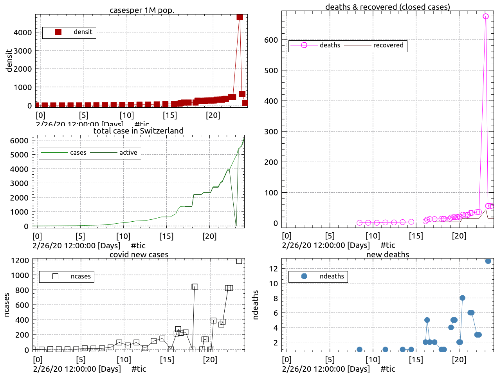

## Daily status on the coronavirus COVID-19 pandemy in Switzerland

 YAML data file : [covid.yml](covid.yml)
 CSV data file : [covid.csv](covid.csv)
 PNG data file : [covid.png](covid.png)
 
 

- \[03/23/20]: 7245/7474cases [QmfSou6FqHDQEX9XBWGm78jwUK4fP4DWViJXHMDM3Hb6wK](https://cloudflare-ipfs.com/ipfs/QmY4pmA4H2abNWnWZpw9NNz1vS577dF9u4Ap2ZYt1Jh1GC) [data](/ipfs/QmX7vN3HQhUJtG4E1WhPc1ij5ZqeixnSLU8FHitVQwQM1U/covid.yml),[csv](/ipfs/QmX7vN3HQhUJtG4E1WhPc1ij5ZqeixnSLU8FHitVQwQM1U/covid.csv)
- \[03/23/20]: 7245/7474cases [QmfLKW2NgAWdT3dTTAbTwpjfTxzwFkUosdpvha2yLASqBw](https://cloudflare-ipfs.com/ipfs/QmY4pmA4H2abNWnWZpw9NNz1vS577dF9u4Ap2ZYt1Jh1GC) [data](/ipfs/Qmb6kW2EoePgbN33w9csnANHsUJosvsxjwzXEfSrwgJBEf/covid.yml),[csv](/ipfs/Qmb6kW2EoePgbN33w9csnANHsUJosvsxjwzXEfSrwgJBEf/covid.csv)
- \[03/22/20]: 7245/7474cases [QmTP5ohWDRgTAooXehgpTs2639kErC3imnHAzu1W8JKEKU](https://cloudflare-ipfs.com/ipfs/QmY4pmA4H2abNWnWZpw9NNz1vS577dF9u4Ap2ZYt1Jh1GC) [data](/ipfs/QmZhaMTHB93UezzX89hfpaMDtfFCkHKWT9C5WJbCJ7GkyW/covid.yml),[csv](/ipfs/QmZhaMTHB93UezzX89hfpaMDtfFCkHKWT9C5WJbCJ7GkyW/covid.csv)
- \[03/22/20]: 7245/7474cases [QmNNKnidzGJmj8usn84LkTCxgzBp9yZr9yB7gv5fNawPXZ](https://cloudflare-ipfs.com/ipfs/QmY4pmA4H2abNWnWZpw9NNz1vS577dF9u4Ap2ZYt1Jh1GC) [data](/ipfs/QmVYkXivKWw6sizFSyHuEmT1RdyHHE7vAqc634cQkER65N/covid.yml),[csv](/ipfs/QmVYkXivKWw6sizFSyHuEmT1RdyHHE7vAqc634cQkER65N/covid.csv)
- \[03/22/20]: 7245/7474cases [QmbnsvCY4KDNTBkB5PFReRKssfVtqmCcsbduLiGWC2XkPa](https://cloudflare-ipfs.com/ipfs/QmY4pmA4H2abNWnWZpw9NNz1vS577dF9u4Ap2ZYt1Jh1GC) [data](/ipfs/QmZsrm25PN3a7VkBFNsQ2qyZmhde1gdC7JBzhaA1xZJuZ9/covid.yml),[csv](/ipfs/QmZsrm25PN3a7VkBFNsQ2qyZmhde1gdC7JBzhaA1xZJuZ9/covid.csv)
- \[03/22/20]: 141/7225cases [QmPVxrjiCvxV9Q7tAiYQ7QyQfp1HgTodQiKizpAieRPJoi](https://cloudflare-ipfs.com/ipfs/QmY4pmA4H2abNWnWZpw9NNz1vS577dF9u4Ap2ZYt1Jh1GC) [data](/ipfs/QmcLbqMrdSPiydpydZdD4Q4DiXXxHWZ97UfTL2VMvxCcRv/covid.yml),[csv](/ipfs/QmcLbqMrdSPiydpydZdD4Q4DiXXxHWZ97UfTL2VMvxCcRv/covid.csv)
- \[03/22/20]: 141/7225cases [Qmc63r57ZixRC7qtf12gqWzRrmc2Z9fV1tscbwqqzvYoKz](https://cloudflare-ipfs.com/ipfs/QmY4pmA4H2abNWnWZpw9NNz1vS577dF9u4Ap2ZYt1Jh1GC) [data](/ipfs/QmRAqmc38a3kK6R3XBxH2PCVwvG6F6xNVnSJ7iDbzafyc2/covid.yml),[csv](/ipfs/QmRAqmc38a3kK6R3XBxH2PCVwvG6F6xNVnSJ7iDbzafyc2/covid.csv)
- \[03/21/20]: 6113/6186cases [QmZJTqc58ouioEPYes9BWipPXPUS3p3fabT4asaVAMJaMM](https://cloudflare-ipfs.com/ipfs/QmY4pmA4H2abNWnWZpw9NNz1vS577dF9u4Ap2ZYt1Jh1GC) [data](/ipfs/QmSanADaYvsiRkvsdff5ZvP7J4qEZ8YUivWhkiGvubP73p/covid.yml),[csv](/ipfs/QmSanADaYvsiRkvsdff5ZvP7J4qEZ8YUivWhkiGvubP73p/covid.csv)
- \[03/21/20]: 6113/6186cases [QmZ49qk7Kug4i1umR2HFVwrHUnoX1xrdRKfG4PD4itKe98](https://cloudflare-ipfs.com/ipfs/QmY4pmA4H2abNWnWZpw9NNz1vS577dF9u4Ap2ZYt1Jh1GC) [data](/ipfs/QmUrqmtZufQpZWBFJ1ub5XyoXP2FtihrqYTqheA5PsqXth/covid.yml),[csv](/ipfs/QmUrqmtZufQpZWBFJ1ub5XyoXP2FtihrqYTqheA5PsqXth/covid.csv)
- \[03/21/20]: 5544/5615cases [QmXjbxLNFvsfxKrnwi979tMywauL7wwvmriiuEKDLn1mLy](https://cloudflare-ipfs.com/ipfs/QmY4pmA4H2abNWnWZpw9NNz1vS577dF9u4Ap2ZYt1Jh1GC) [data](/ipfs/QmTFhLQFbWdoWQrKY6fMpjjt8Tt2Dn8DFr8asMebbBXfL6/covid.yml),[csv](/ipfs/QmTFhLQFbWdoWQrKY6fMpjjt8Tt2Dn8DFr8asMebbBXfL6/covid.csv)
- \[03/20/20]: /cases [QmUhwrMeVRT9V5dttpPa7zbToAinsNaH38BY47zoAMzR4P](https://cloudflare-ipfs.com/ipfs/QmY4pmA4H2abNWnWZpw9NNz1vS577dF9u4Ap2ZYt1Jh1GC) [data](/ipfs/QmcVT5hTUyCGKgeZfvvRzSPgXazPjWLMcG5gyH52NE7GKC/covid.yml),[csv](/ipfs/QmcVT5hTUyCGKgeZfvvRzSPgXazPjWLMcG5gyH52NE7GKC/covid.csv)
- \[03/20/20]: /cases [QmR3cWmPDDQeuMLRy2HtLjqpEtTBJuXJQm39R5ViVuaVrV](https://cloudflare-ipfs.com/ipfs/QmY4pmA4H2abNWnWZpw9NNz1vS577dF9u4Ap2ZYt1Jh1GC) [data](/ipfs/Qmdod7WCFHfsumLtpfRbTFjY7rDX8PzrDk9SKGMqFQceRi/covid.yml),[csv](/ipfs/Qmdod7WCFHfsumLtpfRbTFjY7rDX8PzrDk9SKGMqFQceRi/covid.csv)
- \[03/20/20]: 5336/5407cases [QmeHkgkkRJQE1B3P6Z7DiRARCREavAo6eLQ7NFKW2vv5nM](https://cloudflare-ipfs.com/ipfs/QmY4pmA4H2abNWnWZpw9NNz1vS577dF9u4Ap2ZYt1Jh1GC) [data](/ipfs/QmfGmRPV1tZF5zbCycd9h6HVe3eBcAVLeTukgzXyz7kQhG/covid.yml),[csv](/ipfs/QmfGmRPV1tZF5zbCycd9h6HVe3eBcAVLeTukgzXyz7kQhG/covid.csv)
- \[03/20/20]: 5336/5407cases [Qme6JKSnhNQpPBzymrCQvYcsqaB79Pm1WZG8mtTWohyb77](https://cloudflare-ipfs.com/ipfs/QmY4pmA4H2abNWnWZpw9NNz1vS577dF9u4Ap2ZYt1Jh1GC) [data](/ipfs/QmV4XSjSDWYG1dhDpHMBz4Rcot6UQLuB26bSoTZYhwnyFZ/covid.yml),[csv](/ipfs/QmV4XSjSDWYG1dhDpHMBz4Rcot6UQLuB26bSoTZYhwnyFZ/covid.csv)
- \[03/20/20]: 15/4898cases [QmW1FtTyCVtYv71NvgdUenYxRhGkvBQM58c6B7kXbKqMvw](https://cloudflare-ipfs.com/ipfs/QmY4pmA4H2abNWnWZpw9NNz1vS577dF9u4Ap2ZYt1Jh1GC) [data](/ipfs/QmZ7HPJFk1DFJiSFS2HK4xWz5ao7jbHCjLfMTT6PaPLAum/covid.yml),[csv](/ipfs/QmZ7HPJFk1DFJiSFS2HK4xWz5ao7jbHCjLfMTT6PaPLAum/covid.csv)
- \[03/20/20]: 15/4898cases [QmSAFgdzPEQcHeEj59FYZQngW6qX9szaXx2hsxnucWKbkQ](https://cloudflare-ipfs.com/ipfs/QmY4pmA4H2abNWnWZpw9NNz1vS577dF9u4Ap2ZYt1Jh1GC) [data](/ipfs/QmQMxLXm8iYg9uVqaHWDTgd6GS2HPMgUXcbsirrtT5yRwi/covid.yml),[csv](/ipfs/QmQMxLXm8iYg9uVqaHWDTgd6GS2HPMgUXcbsirrtT5yRwi/covid.csv)
- \[03/19/20]: 3888/3939cases [QmYaFJdczS8RAhbNCgTZH6fzpYk6zphpp1mLTbebTDKGUy](https://cloudflare-ipfs.com/ipfs/QmY4pmA4H2abNWnWZpw9NNz1vS577dF9u4Ap2ZYt1Jh1GC) [data](/ipfs/QmZBSfXg1hqQLAUfdtxP33Pyy4MvYjSu9PyyaAH7qUDGR4/covid.yml),[csv](/ipfs/QmZBSfXg1hqQLAUfdtxP33Pyy4MvYjSu9PyyaAH7qUDGR4/covid.csv)
- \[03/19/20]: 3888/3939cases [QmWEacwbdMK642oLQ1Ddu6k4pHnPdWh3pJpNYFUMEV6mbf](https://cloudflare-ipfs.com/ipfs/QmY4pmA4H2abNWnWZpw9NNz1vS577dF9u4Ap2ZYt1Jh1GC) [data](/ipfs/QmTUabGFF3eA3ZfcHfwf649xLJu59pvVgErwGZnq4bwJ2c/covid.yml),[csv](/ipfs/QmTUabGFF3eA3ZfcHfwf649xLJu59pvVgErwGZnq4bwJ2c/covid.csv)
- \[03/19/20]: 3888/3939cases [QmVVkeTjXbBGSTE1HnaEDLBuNDFPSjAjAG2sKdFcRyL5cg](https://cloudflare-ipfs.com/ipfs/QmY4pmA4H2abNWnWZpw9NNz1vS577dF9u4Ap2ZYt1Jh1GC) [data](/ipfs/QmPYhDh1vagW2K8To1tioauJ5sEmTJ2r5o5KnGSyaVVjro/covid.yml),[csv](/ipfs/QmPYhDh1vagW2K8To1tioauJ5sEmTJ2r5o5KnGSyaVVjro/covid.csv)
- \[03/18/20]: 3028/3076cases [QmRTxvVQSMiaYgK8djdSad8CD5HVKnAEVEdDnD6uoScWHy](https://cloudflare-ipfs.com/ipfs/QmY4pmA4H2abNWnWZpw9NNz1vS577dF9u4Ap2ZYt1Jh1GC) [data](/ipfs/QmPtZABC6EchSD8JLzVMfYzQWYwV5h4k5yyrvwtaiwQsCs/covid.yml),[csv](/ipfs/QmPtZABC6EchSD8JLzVMfYzQWYwV5h4k5yyrvwtaiwQsCs/covid.csv)
- \[03/18/20]: 2700/2742cases [QmYWrSRMmR6CAU3yp3opk7vrjBzBmVpiZ2uciFt33zbAR7](https://cloudflare-ipfs.com/ipfs/QmY4pmA4H2abNWnWZpw9NNz1vS577dF9u4Ap2ZYt1Jh1GC) [data](covid.yml),[csv](covid.csv)
- \[03/18/20]: 2700/2742cases [QmYCWNY3jvtrMJoYc8NpMKWduMgcT6fFMStj3hWsw7tKAA](https://cloudflare-ipfs.com/ipfs/QmY4pmA4H2abNWnWZpw9NNz1vS577dF9u4Ap2ZYt1Jh1GC) [data](/ipfs/QmZoJpa3dFabS9RL4FXUTwSCoT1bzK5Ay6WPezUddYKwmm/covid.yml),[csv](/ipfs/QmZoJpa3dFabS9RL4FXUTwSCoT1bzK5Ay6WPezUddYKwmm/covid.csv)
- \[03/18/20]: 2700/2742cases [QmXg4uUtxVWvTWWTPqACsrcCiVuhKs4nAEKTzoRRJtd8BD](https://cloudflare-ipfs.com/ipfs/QmY4pmA4H2abNWnWZpw9NNz1vS577dF9u4Ap2ZYt1Jh1GC) [data](covid.yml),[csv](covid.csv)
- \[03/18/20]: 2700/2742cases [QmUhZp2FtoDtT6FZbZDaDV8ZnBv5nj755owTY5rg4UQEY9](https://cloudflare-ipfs.com/ipfs/QmY4pmA4H2abNWnWZpw9NNz1vS577dF9u4Ap2ZYt1Jh1GC) [data](covid.yml),[csv](covid.csv)
- \[03/18/20]: 2700/2742cases [QmeEKZnY3K8p56WrgVdpxGekvPs7fQiB8x6527yc5rUk7F](https://cloudflare-ipfs.com/ipfs/QmY4pmA4H2abNWnWZpw9NNz1vS577dF9u4Ap2ZYt1Jh1GC) [data](/ipfs/QmYVocqLuSJ1M8dwQwJ3YB54NmCGZ56aQrdYe9oMsgfbUv/covid.yml),[csv](/ipfs/QmYVocqLuSJ1M8dwQwJ3YB54NmCGZ56aQrdYe9oMsgfbUv/covid.csv)
- \[03/17/20]: 2700/2742cases [QmZjmZsSibXaWoTip9gdWFw25wSv9CaAjC2eJmftdVy76f](https://cloudflare-ipfs.com/ipfs/QmY4pmA4H2abNWnWZpw9NNz1vS577dF9u4Ap2ZYt1Jh1GC) [data](covid.yml),[csv](covid.csv)
- \[03/17/20]: 2330/2353cases [QmX6ta3w5UKrtRmyCaLcX688YKXxS5aDuvJPGH12QqvCkD](https://cloudflare-ipfs.com/ipfs/QmY4pmA4H2abNWnWZpw9NNz1vS577dF9u4Ap2ZYt1Jh1GC) [data](covid.yml),[csv](covid.csv)
- \[03/17/20]: 2330/2353cases [QmVo1i9NSvBFvnL2Fv2z7oPPudW1EynWa9tbViFTThRBLf](https://cloudflare-ipfs.com/ipfs/QmY4pmA4H2abNWnWZpw9NNz1vS577dF9u4Ap2ZYt1Jh1GC) [data](covid.yml),[csv](covid.csv)
- \[03/17/20]: 2330/2353cases [QmV8TK16duBgoPXAEQsbD1jQdywSM9fUBUqXLKiePexGeV](https://cloudflare-ipfs.com/ipfs/QmcTzxFKvB3A3EPCZBYpazTSajuC1LBEXTmnC3kLRLji6W) [data](covid.yml),[csv](covid.csv)
- \[03/17/20]: 2330/2353cases [QmTnDy7AYYM2Ne7GQyW4HerrcziVXBHQcF5vpekuNmhFBs](https://cloudflare-ipfs.com/ipfs/QmY4pmA4H2abNWnWZpw9NNz1vS577dF9u4Ap2ZYt1Jh1GC) [data](covid.yml),[csv](covid.csv)
- \[03/17/20]: 2330/2353cases [Qma69J5m6CfcMKv5UN5AqaUDoVKPXt8Kh8Z19aF5TkCxSS](https://cloudflare-ipfs.com/ipfs/QmbV6mv5po1G6nzMWDyrcBg68owmrZSz55WTKYsM5XHsRb) [data](covid.yml),[csv](covid.csv)
- \[03/17/20]: 2329/2354cases [QmY7DpgGkEF9RCBTRYDYfK1Y9kRguSwhVzRicPMC5pCUdu](https://cloudflare-ipfs.com/ipfs/QmY4pmA4H2abNWnWZpw9NNz1vS577dF9u4Ap2ZYt1Jh1GC) [data](covid.yml),[csv](covid.csv)
- \[03/17/20]: 2329/2354cases [QmUt9We6jdhK9H7GavKgpPAsR6nNFPPwKAg4wQUpqepFMV](https://cloudflare-ipfs.com/ipfs/QmY4pmA4H2abNWnWZpw9NNz1vS577dF9u4Ap2ZYt1Jh1GC) [data](covid.yml),[csv](covid.csv)
- \[03/16/20]: /cases [QmZcNCbwmQB9oGRK8TCqPcHdHKHJ4un4fvThikQqhDE4A2](https://cloudflare-ipfs.com/ipfs/QmZkR9ssRLbAdAiq2VTno5pkbLVu7po8rnfj7eQWANT3cp) [data](covid.yml),[csv](covid.csv)
- \[03/16/20]: 2330/2353cases [QmexLTMAJqJS3SvTYMfSfKTQYz6Yyz8yPpFU69dXToWiQH](https://cloudflare-ipfs.com/ipfs/QmaCKQjx1EBdwgVJP79wG681by7biv8XKxuRnjyFcQQfWN) [data](covid.yml),[csv](covid.csv)
- \[03/16/20]: 2330/2353cases  [data](covid.yml),[csv](covid.csv)
- \[03/16/20]: 2199/2221cases [QmZeK9dXvjyUKEABd96mh5GpHMniPxvGe3uTdDx562GSW4](https://cloudflare-ipfs.com/ipfs/QmQrTNUgYdKX7k7Lu3B4PSqyrP4NLbY11qQFhRXDc544PQ) [data](covid.yml),[csv](covid.csv)
- \[03/16/20]: 2199/2217cases [QmVXYMEddDdHpAm2MNb68F3jhm3DuKeYbtfHUXAx8RPhwq](https://cloudflare-ipfs.com/ipfs/Qma7fUgFw8Du11apxymg5W2c6bKNhzWtfo9AJ7C4bY6gkN)
- \[03/16/20]: 2199/2217cases  [data](covid.yml),[csv](covid.csv)
- \[03/15/20]: [QmYi3BGiWXvSjd5aZs8nfkKbGKZH4yq9pxB8TZ6bpfCVT2](https://cloudflare-ipfs.com/ipfs/QmYi3BGiWXvSjd5aZs8nfkKbGKZH4yq9pxB8TZ6bpfCVT2)
- \[03/15/20]: [QmXGQr3JD3kfXi45Emzi25j59YGDaug8aseqtjXadL9uBf](https://cloudflare-ipfs.com/ipfs/QmXGQr3JD3kfXi45Emzi25j59YGDaug8aseqtjXadL9uBf)
- \[03/15/20]: [QmXEKK495VdHxJihvcWyGqn3wB82R2eVnudGFe4Qhay8Pt](https://cloudflare-ipfs.com/ipfs/QmXEKK495VdHxJihvcWyGqn3wB82R2eVnudGFe4Qhay8Pt)
- \[03/15/20]: [QmVcnAXwt6DK3tF1zEkzBe7UhX8Eq97db6sm9N2Hbens8H](https://cloudflare-ipfs.com/ipfs/QmVcnAXwt6DK3tF1zEkzBe7UhX8Eq97db6sm9N2Hbens8H)
- \[03/15/20]: [QmTML4ShH4USpvsA9Y6iRWgePaEC63GnywyyuK9mKGbBue](https://cloudflare-ipfs.com/ipfs/QmTML4ShH4USpvsA9Y6iRWgePaEC63GnywyyuK9mKGbBue)
- \[03/15/20]: [QmRGXRTPUEr25J56hW4Y3xhtNNG6UgAyUAF1kKZpHHjzU3](https://cloudflare-ipfs.com/ipfs/QmRGXRTPUEr25J56hW4Y3xhtNNG6UgAyUAF1kKZpHHjzU3)
- \[03/15/20]: [QmceCPFgaqzTnt7E1iKU9kpgpeKq6DdETvYKkqPh1JkEPm](https://cloudflare-ipfs.com/ipfs/QmceCPFgaqzTnt7E1iKU9kpgpeKq6DdETvYKkqPh1JkEPm)
- \[03/15/20]: [QmbYF3GM1zaM9caRvqRVygnNJPgg6rDQFQamnVDZax119C](https://cloudflare-ipfs.com/ipfs/QmbYF3GM1zaM9caRvqRVygnNJPgg6rDQFQamnVDZax119C)
- \[03/15/20]: [QmaxWSxg3HQjkRiwLuoganijk1oJtiGanTjJczaSjrpGfa](https://cloudflare-ipfs.com/ipfs/QmaxWSxg3HQjkRiwLuoganijk1oJtiGanTjJczaSjrpGfa)
- \[03/15/20]: [Qmao98TzoBoqHKaujcm5e2UttMgBJ427BvjxaWPAER4p9g](https://cloudflare-ipfs.com/ipfs/Qmao98TzoBoqHKaujcm5e2UttMgBJ427BvjxaWPAER4p9g)
- \[03/15/20]: 2199/2217cases [QmYuxsNNmLcanK4rAXTTAMPo6n1HVc74VcL1ic9eSXuAz3](https://cloudflare-ipfs.com/ipfs/QmPnDL68DxWLXwB2T2SzykQuNTDHZSKkG35dNTXFKYRxHY)
- \[03/15/20]: 2199/2217cases [QmYPJxjsqrZahzCfnEAwZoWRqGCXFfSJsFLax5YNUrJP1U](https://cloudflare-ipfs.com/ipfs/QmYPJxjsqrZahzCfnEAwZoWRqGCXFfSJsFLax5YNUrJP1U)
- \[03/15/20]: 2199/2217cases [QmYKbARh5TFTPpQLmGGGimcmaLgmTL8R8qJwn2UmGG98z3](https://cloudflare-ipfs.com/ipfs/QmTwyhPCLD2fbwthDPdEsJi8F8bvj2BULGpcuN7owrsvtp)
- \[03/15/20]: 2199/2217cases [QmWC3iqNXMoyYFD9UsFaz7zngbnQ7WbNJVmTZWuYZXagZt](https://cloudflare-ipfs.com/ipfs/QmSkkaGuHCMSzJGB9vkxkekQMZ7ihZAS8gvouQy2VFgcfx)
- \[03/15/20]: 2199/2217cases [QmViYsjkRxqJS922ciKvevpKzZBZLLbpVFrnd5Di51tddM](https://cloudflare-ipfs.com/ipfs/QmViYsjkRxqJS922ciKvevpKzZBZLLbpVFrnd5Di51tddM)
- \[03/15/20]: 2199/2217cases [QmRWKSyAs79cAfmEKMrh9TpSDHk19aNv1w4oDd8T26SdfA](https://cloudflare-ipfs.com/ipfs/QmRxPGPzaYLcScroMdYtzpnBfz1o93YeiseH4RhB6gYUec)
- \[03/15/20]: 2199/2217cases [QmRVbPHrDjqbG1NoUGPuxovYs1GMMYGpyo2aY3TFNPTioK](https://cloudflare-ipfs.com/ipfs/Qmbw9gAgnxZ5cqZrm9rFW8JjyT8bbrHHvPN5UjzGwBCBJj)
- \[03/15/20]: 2199/2217cases [QmR8yWTQACFbzezhRtXEGMDzGXHN8pMdWMq9MGpcWrwNnj](https://cloudflare-ipfs.com/ipfs/QmU3iQYEB5XHXxQUoQiervN1bCGBmypStmh75MQeiGo5Xf)
- \[03/15/20]: 2199/2217cases [QmQSagrhiiPVyXe8Kx6V4TSkDS4b9HJpFsCiajHF1jpoWp](https://cloudflare-ipfs.com/ipfs/QmUiaA46SeKFHDDKS2R5Ao2TrWNKwfES81DQKFkZKixipN)
- \[03/15/20]: 2199/2217cases [QmPLXimLD6ydc1a5TGE6UcsPyNaZNBbGuqmf5EbEuNio1i](https://cloudflare-ipfs.com/ipfs/QmZX6fyynMXwU8rEbRT98zQ3QxWbEv7iKGMvkCdZUoaM2k)
- \[03/15/20]: 2199/2217cases [QmPgZXRF7bS3oQoDBobPeudTPHgt2LahDzogeMBSaxKHSF](https://cloudflare-ipfs.com/ipfs/QmPgZXRF7bS3oQoDBobPeudTPHgt2LahDzogeMBSaxKHSF)
- \[03/15/20]: 2199/2217cases [QmfJPwpMUY9fQkFdXLv4GaaEWfhvo59tapCmqSksxvEERn](https://cloudflare-ipfs.com/ipfs/QmfJPwpMUY9fQkFdXLv4GaaEWfhvo59tapCmqSksxvEERn)
- \[03/15/20]: 2199/2217cases [QmfB61Af8XTimyvdnottAoZaqt5ndRWwCFnMtswMuAhNdY](https://cloudflare-ipfs.com/ipfs/QmfB61Af8XTimyvdnottAoZaqt5ndRWwCFnMtswMuAhNdY)
- \[03/15/20]: 2199/2217cases [QmeXj4bq3MiT3YPqT2CMkNhGsCzwJxZCgF2N8hNJhgHHJD](https://cloudflare-ipfs.com/ipfs/QmeXj4bq3MiT3YPqT2CMkNhGsCzwJxZCgF2N8hNJhgHHJD)
- \[03/15/20]: 2199/2217cases [Qmdxw5b8QKMk9xdA5jFwitbuFDTfjJh8G96TtSRr6GrPAm](https://cloudflare-ipfs.com/ipfs/Qmdxw5b8QKMk9xdA5jFwitbuFDTfjJh8G96TtSRr6GrPAm)
- \[03/15/20]: 2199/2217cases [QmdkDv4VHrQqtMr7RC7RRsSt3ynk4VZuWSfFvK3zvTTT5o](https://cloudflare-ipfs.com/ipfs/QmdkDv4VHrQqtMr7RC7RRsSt3ynk4VZuWSfFvK3zvTTT5o)
- \[03/15/20]: 2199/2217cases [QmcmP1nHwLCu9jHNYGF42vjiqBJgS8Qro8s45ZHxAK7Uc7](https://cloudflare-ipfs.com/ipfs/QmcmP1nHwLCu9jHNYGF42vjiqBJgS8Qro8s45ZHxAK7Uc7)
- \[03/15/20]: 2199/2217cases [QmbxTjT4msLftWmKiYWnWApq9QrP5stjLjfzQDeHQSGNYZ](https://cloudflare-ipfs.com/ipfs/QmbxTjT4msLftWmKiYWnWApq9QrP5stjLjfzQDeHQSGNYZ)
- \[03/15/20]: 2199/2217cases [QmbWLrrpBCrbx43Bo5KLwpSfpAiGNx6Eu3YBz6D7UJ5nwB](https://cloudflare-ipfs.com/ipfs/QmbWLrrpBCrbx43Bo5KLwpSfpAiGNx6Eu3YBz6D7UJ5nwB)
- \[03/15/20]: 2199/2217cases [QmbB2WzoUBnkVNJ5szYJLweCLFDcn2W1agtiLq3MBGaaHt](https://cloudflare-ipfs.com/ipfs/QmfJajhVBRPS12J7VYg4U3ymGMGhLaNFyACRfyyQe9GjEX)
- \[03/15/20]: 1358/1376cases [QmWZ3bbYWpDZRPNLGT5snipxk7wSPhioLdBiTEbjo9HgkA](https://cloudflare-ipfs.com/ipfs/QmWZ3bbYWpDZRPNLGT5snipxk7wSPhioLdBiTEbjo9HgkA)
- \[03/15/20]: 1358/1376cases [QmRKN259cPwiRsXNXbRBzeR5WuHxhAxeYUUYex1GUWNrL6](https://cloudflare-ipfs.com/ipfs/QmRKN259cPwiRsXNXbRBzeR5WuHxhAxeYUUYex1GUWNrL6)
- \[03/15/20]: 1358/1376cases [QmPmwb1zJzjqcdUosVxoAsFhLR118iPbTS9nfTrCqEPXdm](https://cloudflare-ipfs.com/ipfs/QmPmwb1zJzjqcdUosVxoAsFhLR118iPbTS9nfTrCqEPXdm)
- \[03/15/20]: 1358/1375cases [QmZCVViAdgYo1BXNgDasm12JAv3wpJhKQVUYRW7XLEWpeY](https://cloudflare-ipfs.com/ipfs/QmZCVViAdgYo1BXNgDasm12JAv3wpJhKQVUYRW7XLEWpeY)
- \[03/15/20]: 1358/1375cases [QmXSNnpgAdLEaye49Zk4nzE16ezL67wKUCihTkwePV25ni](https://cloudflare-ipfs.com/ipfs/QmXSNnpgAdLEaye49Zk4nzE16ezL67wKUCihTkwePV25ni)
- \[03/15/20]: 1358/1375cases [QmTVAVXU5zoPB63Whuqxc8d358v4Wwcsf38v143ycg7RHh](https://cloudflare-ipfs.com/ipfs/QmTVAVXU5zoPB63Whuqxc8d358v4Wwcsf38v143ycg7RHh)
- \[03/15/20]: 1358/1375cases [QmS6CqUwiTNQrjXHscvVkxBWaz3KhqvjgCqkHUcKNA7Wzn](https://cloudflare-ipfs.com/ipfs/QmS6CqUwiTNQrjXHscvVkxBWaz3KhqvjgCqkHUcKNA7Wzn)
- \[03/15/20]: 1358/1375cases [QmRYeqHpFVw9vDwnhMq59x5bwsYNPZDA5AFp26hcdZv6Ps](https://cloudflare-ipfs.com/ipfs/QmRYeqHpFVw9vDwnhMq59x5bwsYNPZDA5AFp26hcdZv6Ps)
- \[03/15/20]: 1358/1375cases [QmQUzJKtYtD7C8MGkMDckW2hTrHWg8MLaNYZjUQQjqa8kP](https://cloudflare-ipfs.com/ipfs/QmQUzJKtYtD7C8MGkMDckW2hTrHWg8MLaNYZjUQQjqa8kP)
- \[03/15/20]: 1358/1375cases [QmPCGBPSMc8Uhw3roYFEtVYDThRyk989KcoBvr5LzFRqWu](https://cloudflare-ipfs.com/ipfs/QmPCGBPSMc8Uhw3roYFEtVYDThRyk989KcoBvr5LzFRqWu)
- \[03/15/20]: 1358/1375cases [QmdKU4VoUgMvZmXQ9eMzMnQqVwSWCNZdEevqz3nk2g6BvT](https://cloudflare-ipfs.com/ipfs/QmdKU4VoUgMvZmXQ9eMzMnQqVwSWCNZdEevqz3nk2g6BvT)
- \[03/15/20]: 1358/1375cases [QmcUD9yS6cChyMEWyN3CvxWCYEGWgpX5EnjhBfxtUp1gCc](https://cloudflare-ipfs.comipfs/QmcUD9yS6cChyMEWyN3CvxWCYEGWgpX5EnjhBfxtUp1gCc)
- \[03/15/20]: 1358/1375cases [QmbLiMdbKCJCPSRWyo2JBTJXhnbKgnkBunm9kaBvqCJeV2](https://cloudflare-ipfs.com/ipfs/QmbLiMdbKCJCPSRWyo2JBTJXhnbKgnkBunm9kaBvqCJeV2)
- \[03/14/20]: 1358/1375cases [QmbAgqTQ2JYzftULxQ18TYsZVbtaK6jUScheSNpujBmz3h](https://cloudflare-ipfs.com/ipfs/QmbAgqTQ2JYzftULxQ18TYsZVbtaK6jUScheSNpujBmz3h)
- \[03/14/20]: 1358/1375cases [QmapJ2VdN8ogzoRDxFzaqWh6Rz67GSbzk88ESnx7XZenur](https://cloudflare-ipfs.com/ipfs/QmapJ2VdN8ogzoRDxFzaqWh6Rz67GSbzk88ESnx7XZenur)
